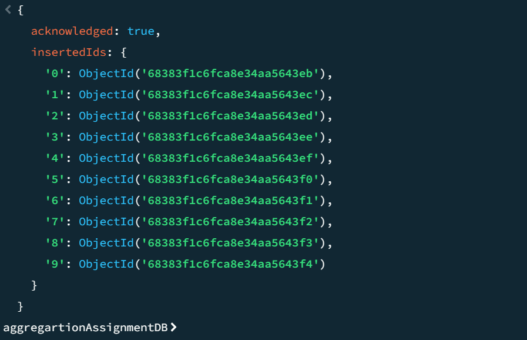
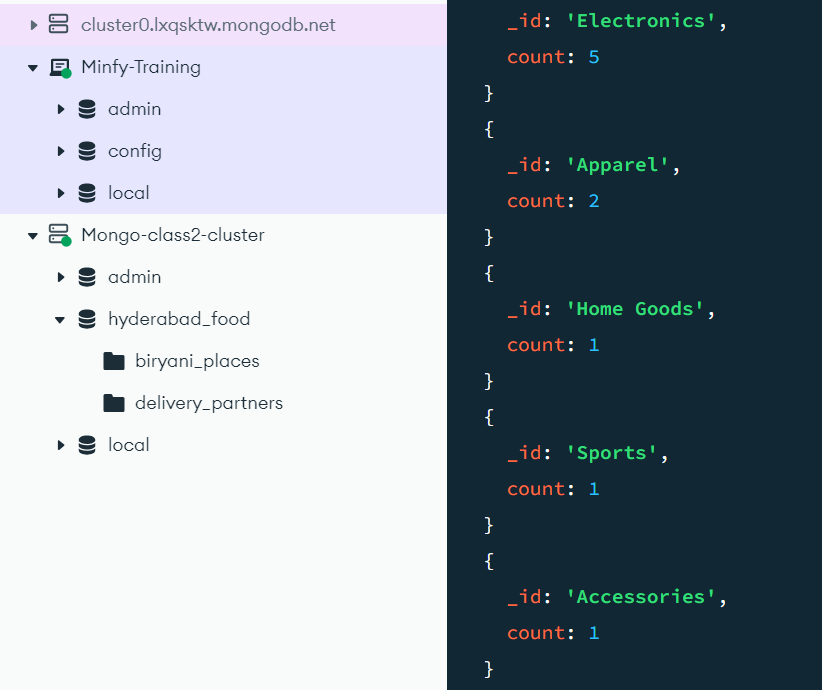

# EASY

### DB created with sample data


### 1. List All Products in the "Electronics" Category:
```
db.products.aggregate([
  {
    $match: {
      category: "Electronics"
    }
  }
])
```

### 2. Count Products per Category:
```
db.products.aggregate([
    { $group: {
      _id: "$category",  
      count: {
        $sum: 1
        } 
    }
  }
])
```
#### SHELL--


### 3. Product Names and Prices, Sorted by Price (Descending):
```
db.products.aggregate([
  {
    $project: {
      _id: 0,
      name: 1,
      price: 1
    }
  },
  {
    $sort: {
      price: -1
    }
  }
])
```